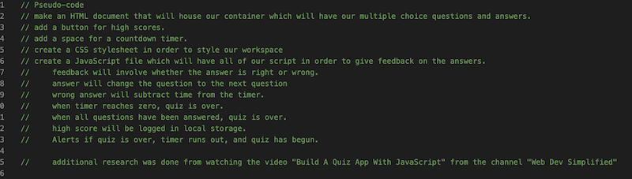
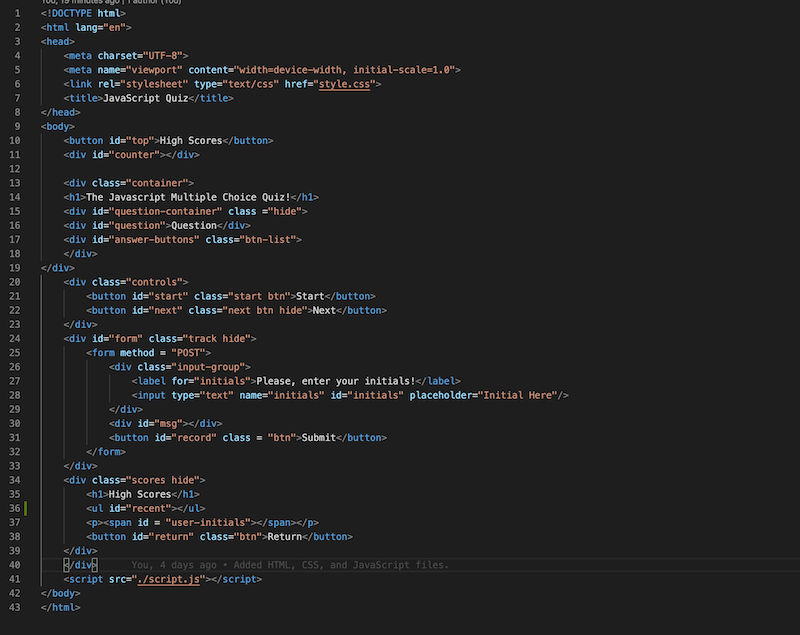
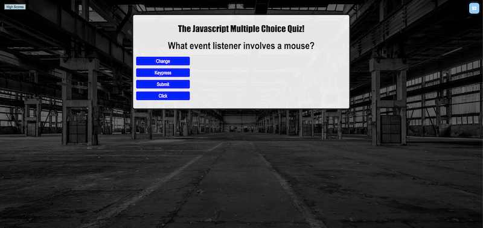
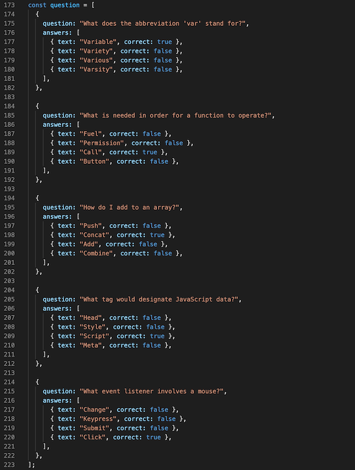
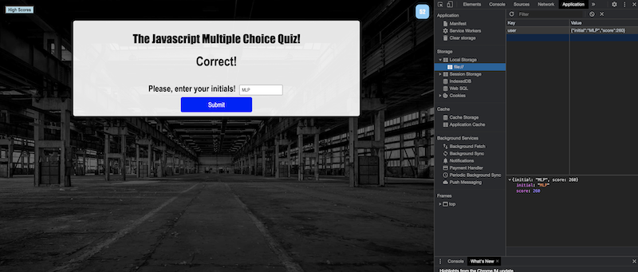

# Javascript Code Quiz

## Overview
We were tasked to create a multiple choice quiz over basic JavaScript knowledge with certain criteria. Some of the main criteria included the quiz needed to be timed, a wrong answer would deduct time from the timer, and a high score would be calculated, and the timer reaching zero or all questions being answered would result in a game over. This was a very challenging assignment for me and I'm sure I annoyed all of the BCS learning assistants I talked to. But, here is what I was able to do.

### Process

The first thing I did when approaching this project was to Pseudocode it. We were not given any starting pages for this project unlike the last one which at least gave us an HTML and a CSS page to have something to go on. We had to start off everything from scratch for this one. Pseudocoding would ensure that I was able to make and follow a game plan. I had also tried to look up some YouTube videos online in order to get some inspiration as well as googled other quiz projects. Ultimately, that would be more harmful than helpful because none of the other resources I looked to would help me meet the acceptance criteria. Even trying to draft a template off of what I was looking at would prove to be futile since down the line it would all need to be replaced or changed anyway.

After establishing a game plan, I typed out some HTML so I would have something to go on. Initially, I created a list of buttons for the selections, but with JavaScript, that would prove to be unnecessary since I could just create the buttons in JavaScript itself. In the end, I wound up with a pretty small HTML page:

This page would also be styled with some CSS. We were given a .gif of an example of what the finished product could look and behave like. I opted to give mine a little more style since I can do CSS relatively quick. The end result would look a bit different from the example, but it would function the same:

Once the HTML and CSS were to my liking, it was time to do the actual work. This was the hardest part of not only this assignment, but any assignments I've ever faced this far. The vast majority of the quiz and how it operates would be handled thorugh JavaScript. This would include making an array for questions/answers which would generate buttons as needed. I kept my answer options to 4 for each question, just so everything appeared uniform on the screen. These order in which these questions appeared would be random. selecting the correct answer would result in a point being awarded. Selecting the wrong answer would result in 5 seconds being taken off of the clock. An example of the question array is below:

### Function

Since everything was run by JavaScript, I would be able to show and hide elements as I needed them. This would ensure a neat looking container for the quiz to take place in. Once the quiz starts, the first question will appear along with the possible answer choices. Selecting an answer would result in feedback if it was right or wrong by way of booleans checks in the code. After the feedback, a button would appear which would bring up the next question. There are five questions in total. After the final question has been answered, the number of questions that were answered correctly would be multiplied by the remaining time on the clock which would give the final score. The user would then get a chance to enter their initials which would be stored along with their final score in the local storage. 

### Final Thoughts
This was a very challenging assignement. There were times when I didn't know what to do or how to even begin. I received a lot of encouraging feedback, but this took all of my personal time to work on. I will be spending a lot of time studying and going over everything we were taught in class in order to learn as much as I can. I do not imagine that things will get any easier. Additional comments can be found in the code. 