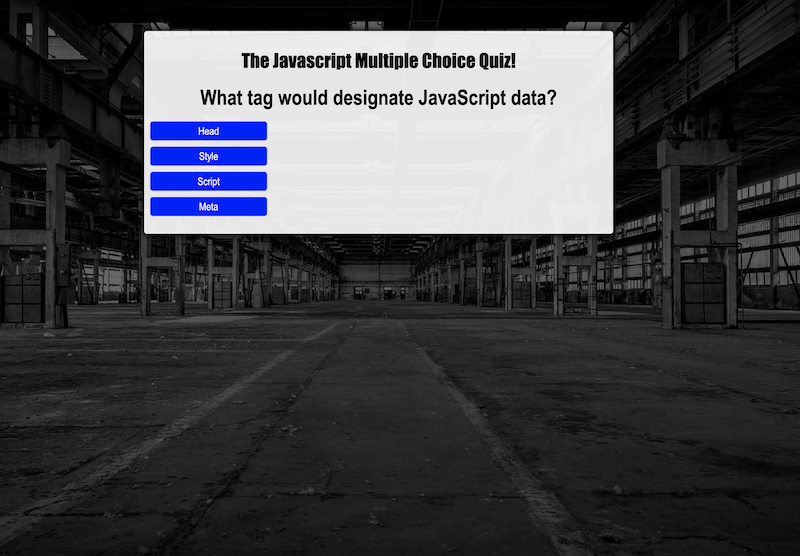

# Javascript Code Quiz

## Introduction
This application is a multiple choice quiz centered around JavaScript. The application is to demonstrate JavaScript and jQuery functionality with dynamically generated content which is displayed into previously empty HTML elements. 

## Technologies Used
* HTML
* CSS
* JavaScript
* jQuery

## Screenshots

 
Screenshot of quiz question

 

 
Gif demonstrating app functionality

 

## Deployed Link
The deployed application can be found [here](https://maynperalta.github.io/JavaScriptCodeQuiz/).

## Contact Information
I can be contacted via email at <maynperalta@gmail.com>.